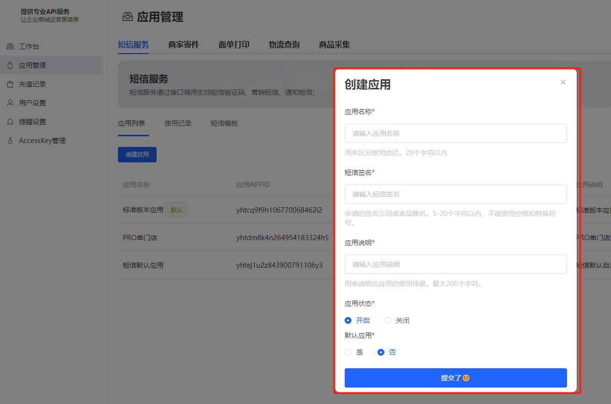

# 使用说明

目前应用类目有：短信服务、商家寄件服务、面单打印服务、物流查询服务、商品采集服务；
每个服务下都可以有多个应用；每个服务的应用最多100个；

### 创建应用

登录后台后进入应用管理，点击创建应用弹窗创建页面；  
应用名称用来区分使用途径；  
短信签名只有在短信服务中存在其他应用都不需要；短信签名审核通过后才可以使用此应用；没有什么通过的签名应用会使用默认签名【CRMEB】；
修改签名后会重新进入签名审核阶段；  
应用说明用来说明使用场景；  
应用状态用来控制应用是否能被使用；  
默认应用会在调用改服务中自动读取该服务下的默认应用；

### 应用列表

列表中的应用APPID使用在接口header中的Appid中；  
签名的状态的已审核通过的才可以在发送短信中被使用；如果没有审核通过，鼠标悬浮在审核未通过标签上会展示
未审核通过的原因；

