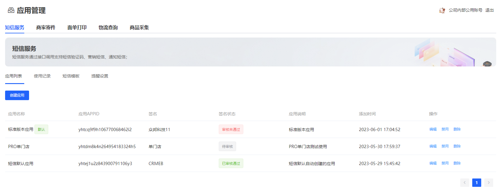
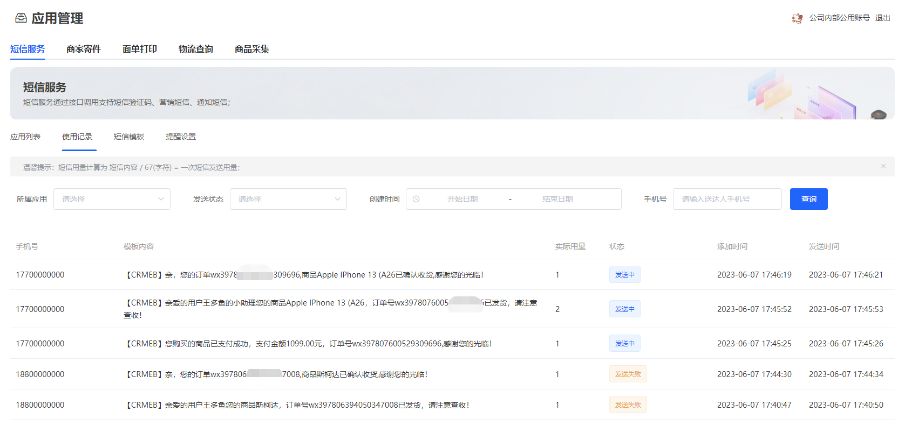
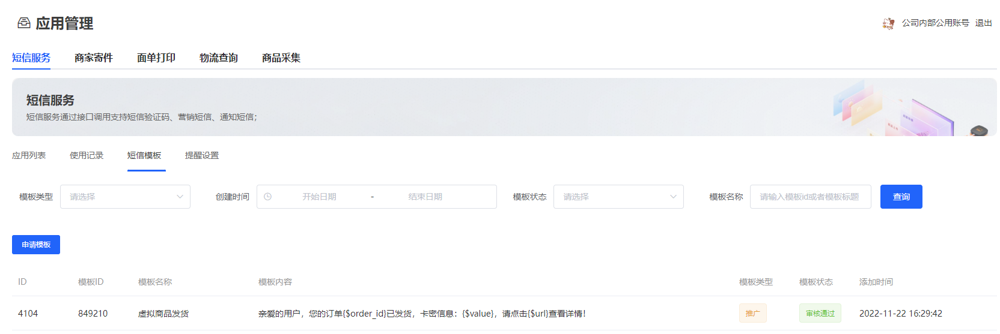
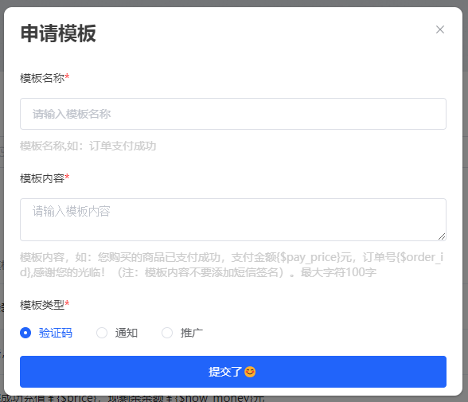
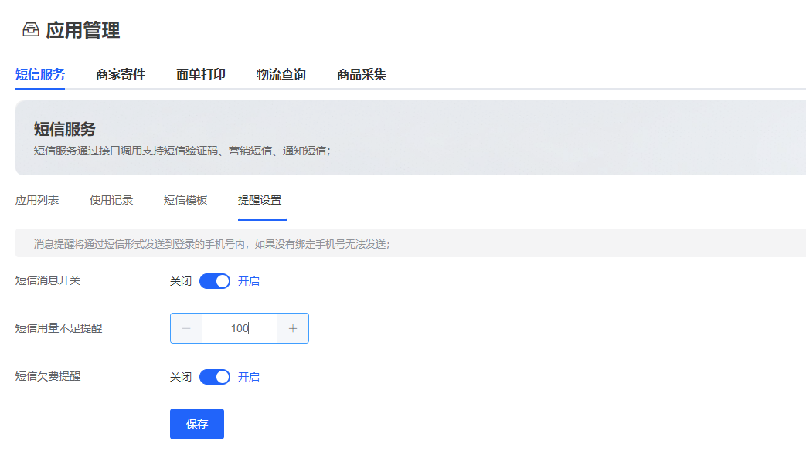

# 使用说明

### 短信用量说明

短信用量计算为 短信内容 / 67(字符) = 一次短信发送用量；比如68个字符也会算为两次用量；

### 应用列表

用来查看应用列表、创建应用、编辑应用、禁用应用、删除应用

### 使用记录
用来查看当前短信服务的发送情况；

### 短信模板

用户可以查看可以使用的模板也可以申请新的模板；列表中的模板ID将使用在短信发送中

申请模板，填写模板名称、模板内容、模板类型；目前模板类型有：验证码、通知、推广三种类型；验证码没有特殊的使用场景可以不用申请，公用的模板里面自带短信验证码模板；  

申请的模板会在1-2个法定工作日内审核；请耐心等待！

只有审核通过并且存储模板ID的短信模板才能被使用；

### 消息提醒

短信消息提醒，默认会从本账号的手机发发出提醒；如果本账号没有绑定手机号是无法接收到消息；

