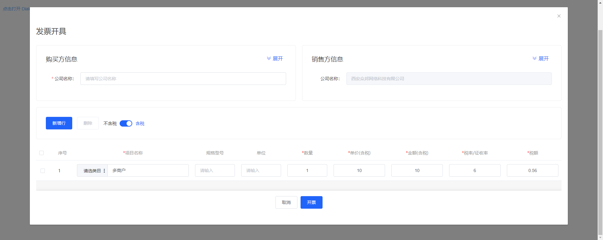
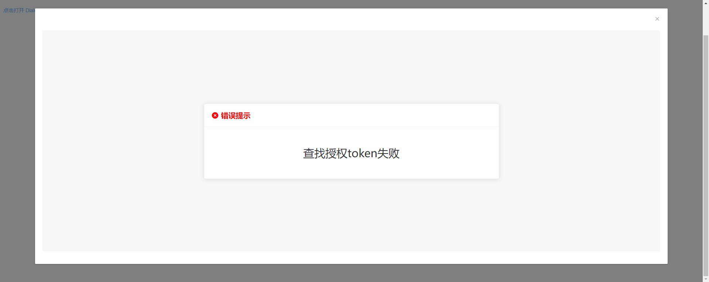

# 获取发票开具页面iframe地址

调用获取发票开具页面iframe地址，返回开具发票页面url

### 请求语法

```html
POST v2/invoice/invoice_issuance_url
```

### 请求头

| 名称 | 类型|是否必填 |示例值| 描述|
|---|---|---|---|---|
| Authorization | 字符串|是|--| 授权TOKEN |
| Content-Type | 字符串|是|application/json;charset=UTF-8| 默认值：application/json;charset=UTF-8 |

### POST请求参数

| 名称 | 类型|是否必填 |示例值| 描述|
|---|---|---|---|---|
| unique | 字符串|是|--| 唯一值 |
| goods | 数组|是|--| 商品信息，详情[查看goods请求参数](#goods) |
| tax_id | 字符串|否|--| 购方纳税人号码 |
| invoice_type | 字符串|否|--| 发票类型，详细类型请查看<a href='/docs/发票开具/附件-参数说明.html#特殊票种类说明'>[附件-参数说明]</a>特殊票种类说明 |
| invoice_tspz_type | 字符串|否|--| 特定要素类型代码，详细类型请查看<a href='/docs/发票开具/附件-参数说明.html#发票类型说明'>[附件-参数说明]</a>发票类型说明 |
| account_name | 字符串|否|--| 购方企业名称 |
| bank_name | 字符串|否|--| 购方开户银行名称 |
| bank_account | 字符串|否|--| 购方银行账户 |
| telephone | 字符串|否|--| 购方电话 |
| company_address | 字符串|否|--| 购方地址 |
| drawer | 字符串|否|--| 开票人 |
| email | 字符串|否|--| 购方邮箱 |

### <a id='goods'>goods请求参数</a>

> 类目分类ID并不是原来商品的ID，是发票开具商品的类目大类；

| 名称 | 类型|是否必填 |示例值| 描述|
|---|---|---|---|---|
| store_name | 字符串|是|--| 商品名称 |
| unit_price | 字符串|是|--| 单价 |
| num | 字符串|是|--| 个数 |
| sku | 字符串|否|--| 规格 |
| unit | 字符串|否|--| 单位 |
| tax_rate | 字符串|否|--| 税率 |
| amount | 字符串|否|--| 总金额 |
| tax_price | 字符串|否|--| 税额 |
| tax_price | 字符串|否|--| 税额 |
| cate_id | 字符串|否|--| 类目分类ID |
| cate_name | 字符串|否|--| 类目分类名称 |

### 响应元素

| 名称 | 类型 |示例值| 描述|
|---|---|---|---| 
| data | 数组|[]| 返回数据，详细[查看data数据](#data) |
| status | 数字|200| 请求状态；200=请求成功；400=请求失败； |
| msg | 字符串|success| 请求文字描述 |

### <a id='data'>data数据</a>

| 名称 | 类型 |示例值| 描述|
|---|---|---|---| 
| uri | 字符串|--| 开具发票打开页面的URL |

### 打开页面成功提示示例

打开此页面后可以在此页面上操作开票业务


### 打开页面错误提示示例

打开此页面会携带token和唯一值,并且token只能使用在发票相关接口中;




