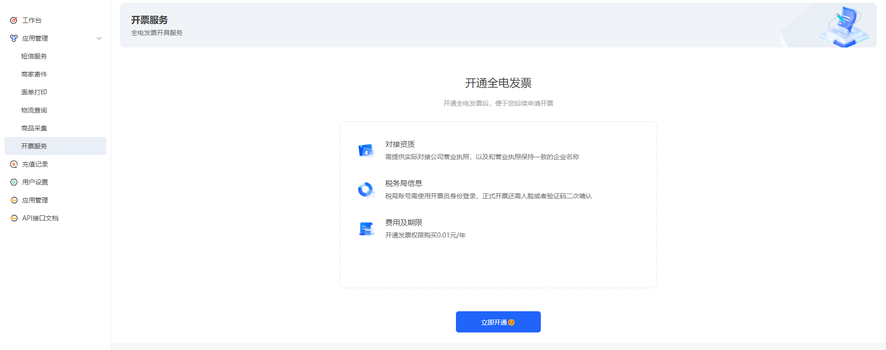
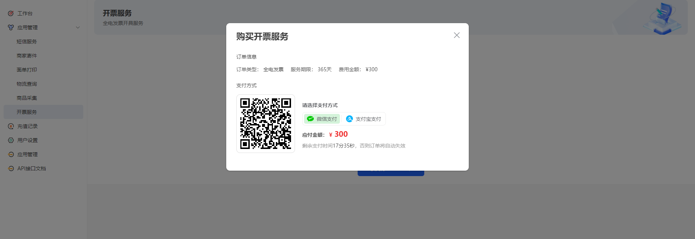
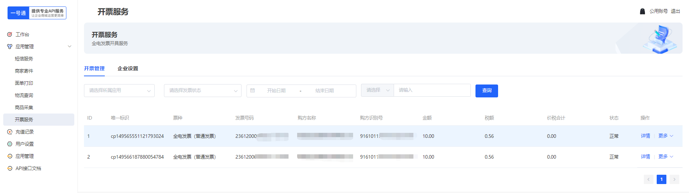
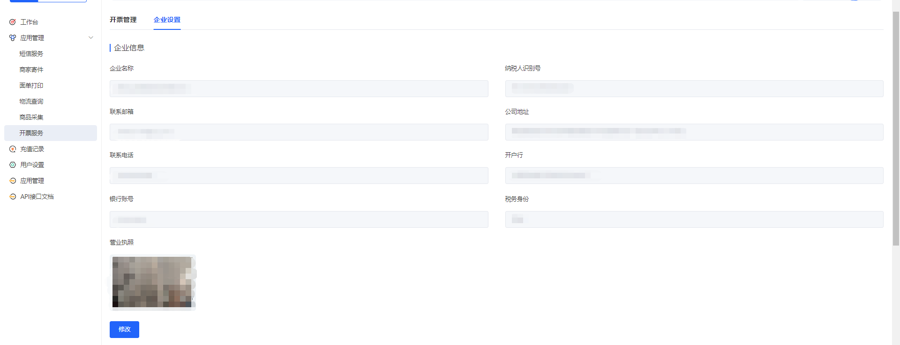

# 使用说明

### 开通全电发票

1. 首次进入发票服务,需要进行开通发票

   
2. 输入信息提交后审核成功，需要支付一年的使用费用

> 截图中的支付金额为假，实际支付金额按照网站内支付展示金额为标准

3. 发票开具管理，可以对通过接口开具的发票进行查看详情、下载、邮箱推送、负数发票开具

   
4. 企业设置可以进行修改用户开票的销方信息；修改后需要一号通平台进行重新审核

   
5. 税务员信息,税务员登录状态

   
6. 回调设置,设置回调地址，在发票开具成功后通过回调地址回调给用户端

