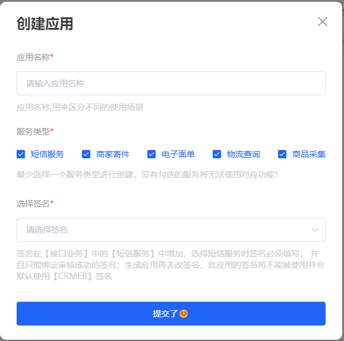
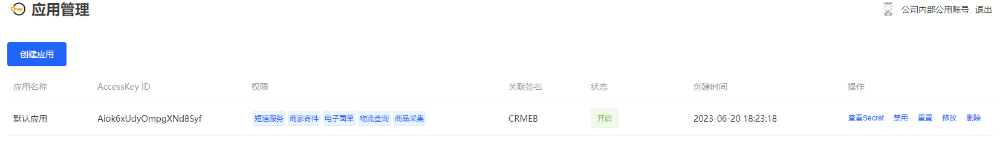

# APPID获取

APPID是用来获取授权token的必要参数，接口的调用都需要使用到它；为防止AppSecret泄露请自行保管；如果发生泄露可以进行禁用或者删除APPID以免造成不必要的损失；

### 获取APPID和AppSecret

登录一号通后台-》应用管理 列表界面，点击创建应用，选择服务类型提交后会自动生成APPID和AppSecret，AppSecret不会在列表进行展示需要点击查看

### APPID的作用

获取授权token的必备参数；APPID的状态也会控制授权token的使用

### 关联签名

需要在【接口业务】-》【短信服务】中添加域名，只有被审核通过的域名才可以被绑定关联；
在调用短信服务接口发送短信时，默认的签名会获取到当前APPID中关联的签名；

### 应用列表

可对应用进行 查看、禁用 、重置、修改、删除操作

